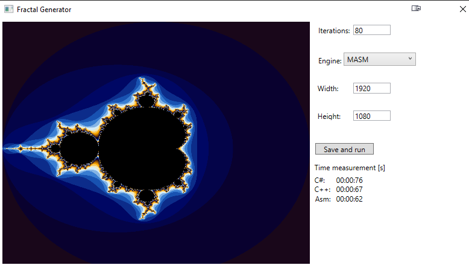

# Mandelbrot Set Generator

This is an application that generates the Mandelbrot Set using code written in C#, C++, and MASM. It was created during the 5th semester of the Computer Science major at the Silesian University of Technology in the academic year 2021/2022 as a part of Assembler Programming Languages course. Its purpose is to show speed difference in code execution in complex task by Assembly (MASM) and two higher level languages.

## How to Build

To build this application, follow these steps:

1. Clone this repository to your local machine.
2. Open the solution file in Visual Studio.
3. Make sure that compilation mode is x64
4. Build the project. (Make sure "Main App" project is set at startup)

## How to use

1. Choose iterations limit in "Iterations" box.
2. Choose which language You want to use in computation using "Engine" list.
3. Choose image size using Width and Height boxes.
4. Click "Save and Run"

After finished execution You will get result preview inside GUI, however full size image will be stored as "mandelbrot.png" file in executable directory.

## Requirements

To use this application, you need to have Visual Studio installed on your machine with .Net 4.7.2, the application was created using Visual Studio 2017.

## Languages Used

This application was created using C#, C++, and MASM. Each language has its own project in the solution explorer.

## License

This application is licensed under the MIT License. See the LICENSE file for more information.
